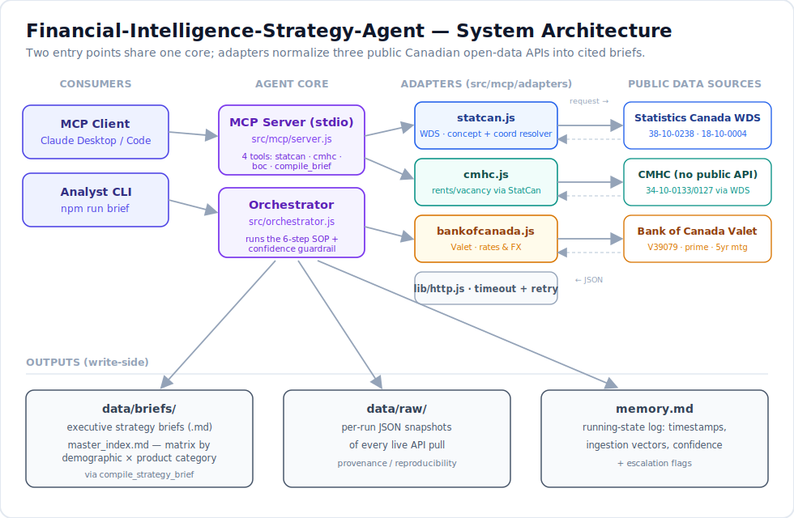
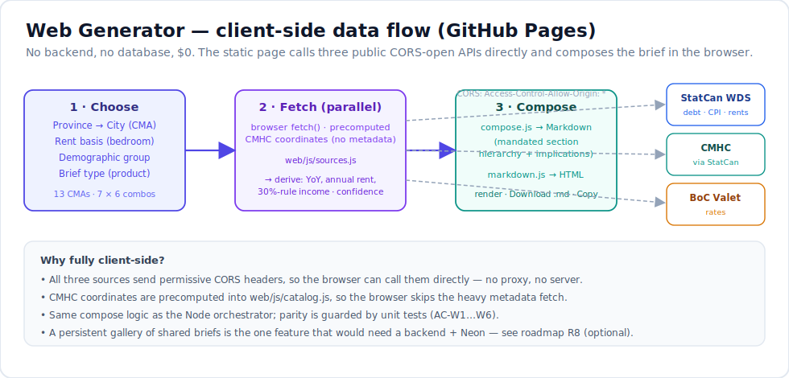
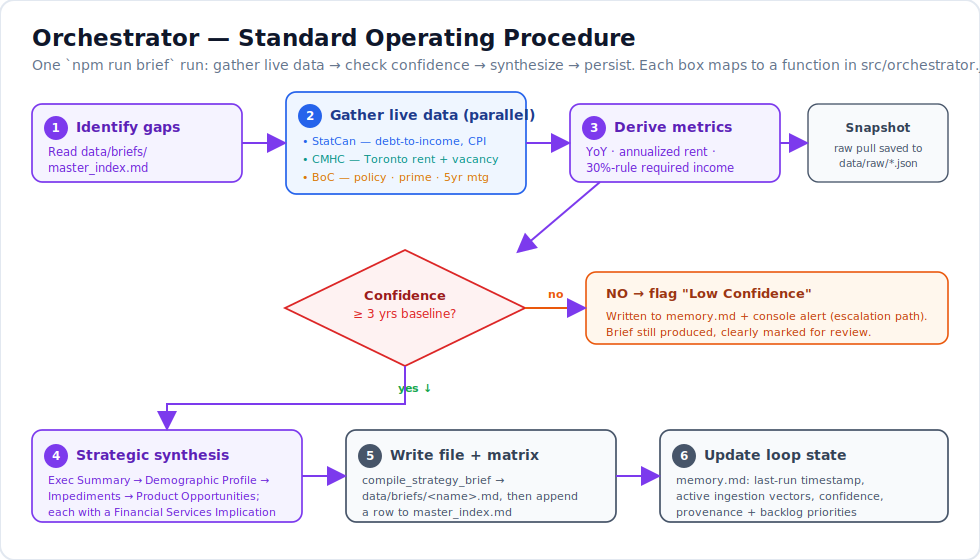

# Financial-Intelligence-Strategy-Agent

An autonomous business-intelligence agent that turns **Canadian public demographic and
housing data** into executive **retail-banking strategy briefs**. It pulls live figures
from Statistics Canada, CMHC, and the Bank of Canada, then synthesizes them into a
structured brief that maps demographic and cost-of-living realities to specific banking
product opportunities — served three ways: a **hosted web generator**, an
[MCP](https://modelcontextprotocol.io) tool server, and a one-command CLI. Built as part of
[My AI Portfolio](https://github.com/shayeeboy) alongside the
[AI-Native Team Diagnostic](https://github.com/shayeeboy/ai-native-diagnostic) and the
[Enterprise RAG Assistant](https://github.com/shayeeboy/Enterprise-RAG-Assistant).

[](https://shayeeboy.github.io/Financial-Intelligence-Strategy-Agent/)
[](https://github.com/shayeeboy/Financial-Intelligence-Strategy-Agent/actions/workflows/ci.yml)


-16a34a)


> Reports empirical trend realities only. It does **not** forecast interest rates or
> market crashes, and does **not** provide legal, compliance, or FINTRAC/Bank Act
> regulatory advice.

---

## See it live

**🍁 [Open the brief generator → shayeeboy.github.io/Financial-Intelligence-Strategy-Agent](https://shayeeboy.github.io/Financial-Intelligence-Strategy-Agent/)**

Pick a **province, city, demographic, and product line**, click *Generate*, and a
complete, sourced strategy brief is built **in your browser** from live data — no
sign-up, no cost, no backend. There are 13 cities × 7 demographics × 6 product lines to
choose from. ([web flow](#web-generator-github-pages))

**📬 [Scheduled email delivery is live](#gaps-and-roadmap) (R9):** subscribe an email to
any brief and receive it **weekly or monthly**, generated fresh from live data. Double
opt-in, one-click unsubscribe, via a Cloudflare Worker + Neon + a daily GitHub Actions
cron — **verified in production, $0/month**.

**🖼️ [Community gallery is live](#gaps-and-roadmap) (R8):** share a generated brief to a
public "recently generated" feed, browse what others built, and click any entry to
regenerate it with today's data — same Worker + Neon, still $0.

**📄 [Or read a pre-generated example → *GTA Newcomer Credit & Daily Banking*](https://github.com/shayeeboy/Financial-Intelligence-Strategy-Agent/blob/main/data/briefs/gta_newcomer_credit_opportunity.md)**

Every figure is pulled from a public API at generation time (the CLI run also snapshots
it to [`data/raw/`](data/raw)). The endpoints are live and key-free — you can hit them
right now:

- **Bank of Canada** overnight target — [`valet/observations/V39079`](https://www.bankofcanada.ca/valet/observations/V39079/json?recent=3)
- **Statistics Canada** household leverage (Table 38-10-0238) — [WDS `getDataFromVectorsAndLatestNPeriods`](https://www.statcan.gc.ca/en/developers/wds/user-guide)
- **CMHC** rents (via StatCan Table 34-10-0133) — [`tv.action?pid=3410013301`](https://www150.statcan.gc.ca/t1/tbl1/en/tv.action?pid=3410013301)

Prefer the CLI? `npm install && npm run brief` regenerates the example end-to-end.

---

## Executive Summary

**Problem.** Financial institutions design products, price credit risk, and plan
branch-vs-digital strategy against a picture of the Canadian consumer that is usually
stale, siloed across agencies, and expressed in raw statistical tables rather than in
product terms. The relevant facts already exist publicly — household leverage
(Statistics Canada), shelter cost and vacancy (CMHC), and the rate environment (Bank of
Canada) — but they live in three different APIs, on three different release cadences,
and none of them says *"…therefore, offer this product to this segment."* Bridging that
last mile is manual, slow analyst work. This agent automates it: it ingests the live
public data and emits a decision-ready strategy brief that maps each data point to a
concrete banking product play.

**User.** Three access tiers for three users. (1) A **business user** — a strategy /
product analyst at a Canadian bank or credit union — who opens the [hosted web
generator](https://shayeeboy.github.io/Financial-Intelligence-Strategy-Agent/), picks a
segment and city, and gets a defensible, sourced brief in seconds, no install. (2) An
**AI/automation engineer** who calls the same capability as composable
[MCP](https://modelcontextprotocol.io) tools from Claude (or any MCP client) inside a
larger workflow. (3) A **developer/analyst** running the CLI headless in a pipeline. The
brief is written for a business reader; the tools are built for a technical one.

**Objective.** Build a production-shaped autonomous-agent pattern — **live tool-use over
real public APIs → structured synthesis → cited, guard-railed output** — on a genuine,
non-trivial domain (Canadian consumer banking strategy), and make it **self-serve**: any
of 13 cities × 7 demographics × 6 product lines generates a complete brief with no
backend and no cost. The banking briefs are the deliverable; the transferable pattern is
*"turn a set of authoritative live data sources into a trusted, sourced, decision-ready
document, with the discipline of something meant to be relied on rather than demoed."*
Every number is traceable to its source; the agent refuses to stray into forecasting or
regulatory advice; and low-evidence outputs flag themselves rather than bluffing.

**Success criteria.** Deliberately split into what is *mechanically verified* and what is
*honestly not yet measured*:

| # | Criterion | Target | Current | Verified by |
|---|---|---|---|---|
| 1 | **Live data, no fixtures** | 100% of headline figures fetched from a public API at run time | 8/8 adapters return live data | `npm run smoke` |
| 2 | **Source traceability** | every reported figure carries a resolvable source URL | 100% (attached by each adapter, by construction) | `npm run smoke` · brief footer |
| 3 | **Vector integrity** | curated StatCan vectors return current, non-null series (no stale/placeholder IDs) | all pass; 2 bad placeholder vectors caught & fixed in build | `npm run smoke` |
| 4 | **Structural completeness** | brief carries all 4 mandated sections + a *Financial Services Implication* in each | met on the live brief | manual + template |
| 5 | **Confidence guardrail** | any series with < 3 yrs baseline is flagged *Low Confidence* in `memory.md` + console | enforced | `npm run check` (AC-M4) |
| 6 | **Safety guardrail** | no rate forecasts / no legal-regulatory advice in output | enforced by prompt + explicit brief disclaimer | manual review |
| 7 | **Deterministic core logic** | metric math, coordinate resolution, and file/matrix writes are unit-tested | **26/26 passing** | `npm run check` |
| 8 | **Self-serve web generation** | every one of 13 × 7 × 6 selections composes a complete, hole-free brief client-side | all 42 demographic×product combos verified; live in browser | `npm run check` (AC-W2), hosted demo |

**Not yet measured (honest gaps).** The brief's **narrative reasoning** (e.g. "newcomers
are thin-file, not low-capacity") is presented as qualitative segment analysis, **not**
auto-validated against cohort micro-data — there is no automated fact-check of the prose.
Figures are **national or metro-level proxies**, not newcomer-*specific* cohort series
(StatCan has those; wiring verified cohort vectors is roadmap item R1). CMHC data is
**annual**, so intra-year shifts aren't captured. And while the app now generates many
briefs on demand, their **quality isn't systematically evaluated** — cross-brief
consistency and analyst-usefulness need a rubric/eval harness (roadmap item R5). See
[Gaps & roadmap](#gaps-and-roadmap).

**Key decisions (the trade-offs that shaped the build).**
- **Generation stays fully client-side — no backend on the hot path.** All three sources
  send `Access-Control-Allow-Origin: *`, so the browser calls them directly; the generator
  is static on GitHub Pages with no server to host or keep warm and **$0**. Generation
  *still* needs no database. A backend was added **only** for the feature that genuinely
  needs one — scheduled **email delivery** (R9): a Cloudflare Worker + Neon Postgres,
  introduced deliberately and late, not as a default. (That same Neon + Worker now also
  unblocks the shared-gallery idea, R8.)
- **CMHC sourced *through* Statistics Canada, not scraped from HMIP.** CMHC's portal has
  no stable public JSON API (it returns HTML); its Rental Market Survey is republished as
  StatCan cubes. Reading those cubes gives versioned, citable data instead of a brittle
  scraper — a deliberate reliability-over-directness call. ([details](docs/DATA-SOURCES.md))
- **A generic coordinate resolver over thousands of hard-coded vector IDs.** CMHC tables
  are multi-dimensional (geography × structure × bedroom). Rather than pin one vector per
  combination, the StatCan adapter resolves human selectors (`'Toronto'`, `'Two bedroom'`)
  to member IDs and builds the 10-part coordinate WDS expects — any CMA/bedroom works.
- **Curated, smoke-validated vectors over blind table queries.** Headline concepts map to
  specific validated vectors so the brief always gets a meaningful series; two wrong
  placeholder vectors (returning `null` at 2018) were caught by the smoke test during the
  build and corrected against live metadata — the test drove the fix.
- **Guardrails that flag over guardrails that hide.** A low-evidence brief is still
  produced, but stamped *Low Confidence* in `memory.md` and on the console, rather than
  silently emitted as if fully backed. Fewer false "high-confidence" outputs, at the cost
  of some flagged ones.
- **MCP server + CLI over the same core.** The four tools are exposed for interactive use
  by an MCP client *and* driven headless by the orchestrator — one implementation, two
  delivery modes, no divergence.

---

## How it works

Three entry points over one synthesis pattern: a **web generator** (static, client-side,
on GitHub Pages), an **MCP server** (four live-data tools an analyst can call from
Claude), and an **orchestrator** (runs the full Standard Operating Procedure headless and
writes a finished brief).

| Layer | What it does | Where |
|---|---|---|
| [**Architecture**](#architecture) | Entry points → agent core → adapters → three public APIs → outputs | `src/mcp`, `src/orchestrator.js` |
| [**Web generator**](#web-generator-github-pages) | Static browser app: pick options → fetch APIs client-side → compose + render a brief | `web/` |
| [**Orchestrator SOP**](#orchestrator-sop) | 6-step workflow: identify gaps → gather → derive → confidence check → synthesize → persist | `src/orchestrator.js` |
| [**Adapters & tools**](#adapters-and-tools) | Normalize StatCan/CMHC/BoC into cited data; compile the brief + matrix | `src/mcp/adapters`, `src/mcp/tools` |
| [**Run it**](#run-it) | `npm run brief`, `npm run mcp`, `npm run smoke`, `npm run check` | `package.json` |
| [**Test cases**](#test-cases-and-acceptance-criteria) | 26 offline unit-acceptance tests + a live integration smoke | `scripts/check.js`, `scripts/smoke.js` |

**Navigate:** [See it live](#see-it-live) · [Architecture](#architecture) · [Web generator](#web-generator-github-pages) · [Orchestrator SOP](#orchestrator-sop) · [Adapters & tools](#adapters-and-tools) · [MCP tools](#mcp-tools) · [Run it](#run-it) · [Test cases](#test-cases-and-acceptance-criteria) · [Repo structure](#repo-structure) · [Tools & services](#tools-and-services) · [Lessons learned](#lessons-learned) · [Gaps & roadmap](#gaps-and-roadmap)

---

### Architecture

Consumers (an MCP client or the CLI) share one agent core. The core calls three
adapters, which each normalize a public Canadian open-data API into a cited, uniform
shape. The write-side persists briefs, a business-facing matrix, raw provenance
snapshots, and a running-state log.



- **Consumers** — an **MCP client** (Claude Desktop/Code) calling the tools
  interactively, or the **Analyst CLI** (`npm run brief`) running the whole SOP.
- **Agent core** — the [`MCP server`](src/mcp/server.js) exposes four tools over stdio;
  the [`orchestrator`](src/orchestrator.js) sequences them into the SOP with the
  confidence guardrail.
- **Adapters** ([`src/mcp/adapters/`](src/mcp/adapters)) — `statcan.js` (WDS + coordinate
  resolver), `cmhc.js` (rents/vacancy via StatCan), `bankofcanada.js` (Valet), all over a
  shared [`http.js`](src/lib/http.js) with timeout + retry.
- **Sources** — Statistics Canada WDS, CMHC (no public API → via StatCan), Bank of Canada
  Valet. All public, all key-free.
- **Outputs** — [`data/briefs/`](data/briefs) (+ `master_index.md` matrix),
  [`data/raw/`](data/raw) snapshots, and [`memory.md`](memory.md).

> The **web generator** is a fourth consumer, but it deliberately *bypasses* the Node
> core: it's a static browser app that talks to the three public APIs directly
> (client-side), so it needs no server. Its data flow is diagrammed below.

[↑ Back to top](#executive-summary)

---

### Web generator (GitHub Pages)

The [hosted generator](https://shayeeboy.github.io/Financial-Intelligence-Strategy-Agent/)
is a **fully static, client-side** app — the CTA the business user actually touches.
*Generating* a brief runs entirely in the browser: no backend, no database, no build step,
**$0** — possible because all three sources send `Access-Control-Allow-Origin: *`, so the
page can `fetch()` them directly. (The optional **email delivery** (R9) and **community
gallery** (R8) on the same page do use a small Cloudflare Worker + Neon — see
[Gaps & roadmap](#gaps-and-roadmap).)



**Controls (the "any brief" matrix).** Province → filters City (13 CMAs); Rent basis
(1/2/3-bedroom); Demographic group (7 cohorts); Brief type / product focus (6 lines) —
**42 demographic×product combinations per city**.

```
Choose (province · city · bedroom · demographic · product)
  → fetch() StatCan + CMHC(via StatCan) + BoC  in parallel, client-side (CORS-open)
  → derive  YoY · annualized rent · 30%-rule income · confidence guardrail
  → compose Markdown (same mandated hierarchy as the CLI)  → render to HTML
  → Download .md  ·  Copy Markdown
```

**Files** ([`web/`](web)): `index.html` + `styles.css` (theme-aware, responsive);
`js/catalog.js` (options + **precomputed CMHC coordinates**, so the browser skips the
heavy metadata fetch); `js/sources.js` (browser data adapters); `js/compose.js` (pure
brief composer); `js/markdown.js` (dependency-free renderer); `js/app.js` (DOM wiring).
The composer, catalog, metrics, and renderer are **pure ES modules that also run in
Node**, so they're unit-tested (AC-W1…W6) and kept in parity with the CLI's
[`src/lib/metrics.js`](src/lib/metrics.js).

Deployed by [`.github/workflows/pages.yml`](.github/workflows/pages.yml) (uploads `web/`
as the Pages artifact on every push that touches it).

[↑ Back to top](#executive-summary)

---

### Orchestrator SOP

One `npm run brief` run executes the six-step Standard Operating Procedure below. Data
gathering is parallelized; the confidence guardrail sits between gathering and synthesis
so a thin-evidence brief is flagged, not silently shipped.



```
1. Identify gaps        read data/briefs/master_index.md
2. Gather live data     StatCan (debt, CPI) ‖ CMHC (rent, vacancy) ‖ BoC (rates)   → snapshot to data/raw/
3. Derive metrics       YoY · annualized rent · 30%-rule required income
4. Confidence check     any series < 3yr baseline?  → flag "Low Confidence" in memory.md + console
5. Strategic synthesis  Exec Summary → Demographic Profile → Impediments → Product Opportunities
                        (every section carries a "Financial Services Implication")
6. Update loop state    write timestamps, ingestion vectors, confidence, backlog to memory.md
```

The synthesis step enforces the mandated brief hierarchy and the house style (Canadian
English — *chequing*, *RRSP*, *behaviours*; segment every section by demographic group
and product category). The safety guardrails (no rate forecasts, no legal/FINTRAC advice)
are baked into the brief template as an explicit disclaimer and honoured in the prose.

[↑ Back to top](#executive-summary)

---

### Adapters and tools

Each adapter returns a uniform, **source-stamped** object (`source`, `source_url`,
`latest`, `trend`, `retrieved_at`) so synthesis never handles a raw API payload.

| Module | Responsibility | Free/public source |
|---|---|---|
| [`adapters/statcan.js`](src/mcp/adapters/statcan.js) | Household leverage & CPI; curated concept→vector registry **and** a generic `resolveCoordinate` for any cube | Statistics Canada WDS |
| [`adapters/cmhc.js`](src/mcp/adapters/cmhc.js) | Average rent & vacancy by CMA + bedroom type | CMHC RMS via StatCan WDS |
| [`adapters/bankofcanada.js`](src/mcp/adapters/bankofcanada.js) | Policy/prime/mortgage rates & FX; one-call rate environment | Bank of Canada Valet |
| [`lib/http.js`](src/lib/http.js) | `fetch` with timeout, retry/backoff, descriptive UA | — |
| [`lib/metrics.js`](src/lib/metrics.js) | Pure helpers: `pct`, `money`, `yoy`, `annualize`, `requiredIncome`, `baselineYears` | — (unit-tested) |
| [`tools/compile_strategy_brief.js`](src/mcp/tools/compile_strategy_brief.js) | Write the brief, append/de-dupe the `master_index.md` matrix row | — |

#### MCP tools

Exposed by [`src/mcp/server.js`](src/mcp/server.js) over stdio (JSON Schema, no zod dep):

| Tool | Purpose | Key inputs |
|---|---|---|
| `query_statcan_financial_behavior` | Household financial-behaviour indicators | `concept` \| `vectorId`, `province`, `latestN` |
| `fetch_cmhc_housing_insights` | CMHC rent/vacancy for a CMA | `cma_zone`, `metric`, `bedroom` |
| `fetch_boc_rates` | BoC rate/FX series, or the full rate environment | `series`, `recent` |
| `compile_strategy_brief` | Write a brief + update the matrix | `filename`, `target_demographic`, `banking_product_focus`, `markdown_body` |

**Wire it into Claude Code / Desktop** — a project-scoped [`.mcp.json`](.mcp.json) is
included:

```json
{ "mcpServers": { "financial-intelligence-strategy-agent": { "command": "node", "args": ["src/mcp/server.js"] } } }
```

[↑ Back to top](#executive-summary)

---

### Run it

```bash
npm install

npm run smoke     # live: verify all 8 data pulls against StatCan/CMHC/BoC
npm run check     # offline: 26 unit-acceptance tests (node --test)
npm run brief     # run the SOP → writes data/briefs/*.md + master_index.md + memory.md
npm run mcp       # start the MCP server on stdio (for an MCP client)
```

All three data sources are public and **need no API key**. Optional client tuning
(`FISA_HTTP_TIMEOUT_MS`, `FISA_HTTP_RETRIES`) is in [`.env.example`](.env.example).

[↑ Back to top](#executive-summary)

---

### Test cases and acceptance criteria

Two suites, mapping to the [success criteria](#executive-summary) above.

**`npm run check`** — offline unit-acceptance of the deterministic core (no network, no
API keys; `node --test`). Each test asserts one acceptance criterion:

| Test | Acceptance criterion | Result |
|---|---|---|
| `AC-M1` format helpers | `pct`/`money` render Canadian figures and are null-safe (`null → "n/a"`) | ✅ |
| `AC-M2` YoY | `yoy` computes same-calendar-period year-over-year change; too-short series → `null` | ✅ |
| `AC-M3` affordability math | `annualize(2045)=24540`; 30%-rule `requiredIncome(24540)=81800` | ✅ |
| `AC-M4` confidence guardrail | `baselineYears` correctly separates ≥3yr (pass) from <3yr (flag Low Confidence) | ✅ |
| `AC-C1` coordinate build | `resolveCoordinate` matches members and zero-fills to the 10-part WDS coordinate | ✅ |
| `AC-C2` safe fallback | unmatched selector falls back to a `Total`/first member, never crashes | ✅ |
| `AC-C3` geography guard | an unknown CMA never silently resolves to the wrong city (falls back to Canada) | ✅ |
| `AC-R1` registry shape | every curated StatCan vector & BoC series has the required fields | ✅ |
| `AC-B1` input safety | `compile_strategy_brief` rejects path-traversal/non-`.md` names and missing fields | ✅ |
| `AC-B2` write + matrix | writing a brief creates the file **and** appends a correct `master_index.md` row | ✅ |
| `AC-B3` idempotent matrix | re-compiling the same filename overwrites content and **de-duplicates** the matrix row | ✅ |
| `AC-W1` web brief structure | `composeBrief` emits all 5 mandated sections + a *Financial Services Implication* in each | ✅ |
| `AC-W2` combinatorial coverage | **all 42** demographic×product combos compose with no template holes (`undefined`/`NaN`) | ✅ |
| `AC-W3` web confidence guardrail | a <3yr series flips the web brief to *Low Confidence* | ✅ |
| `AC-W4` catalog integrity | every CMA has a province + valid 10-part rent/vacancy coordinates; demographics/products well-formed | ✅ |
| `AC-W5` markdown renderer | headings, GFM tables, lists, bold, and links render to correct HTML | ✅ |
| `AC-W6` no metrics drift | `web/js/metrics.js` outputs match `src/lib/metrics.js` for the same inputs | ✅ |
| `AC-E1` subscription validation | valid payload accepted (email normalized); bad email/city/demographic/product/frequency rejected | ✅ |
| `AC-E2` schedule math | `computeNextRun` advances weekly/monthly and **clamps month-length overflow** (Jan 31 → Feb) | ✅ |
| `AC-E3` confirm email | contains the confirm **and** unsubscribe links | ✅ |
| `AC-E4` brief email | renders the brief Markdown with **inline** table styles + unsubscribe link | ✅ |
| `AC-E5` send contract | posts to Resend with `Bearer` auth + one-click `List-Unsubscribe` header; throws w/o key | ✅ |
| `AC-E6` db surface | the Neon query module exports all expected helpers (driver resolves) | ✅ |
| `AC-G1` gallery validation | valid gallery entry accepted; bad city/demographic/product/bedroom rejected | ✅ |
| `AC-G2` gallery label + sanitize | unknown `confidence` is dropped (not fatal); `briefLabel` is human-readable | ✅ |
| `AC-G3` gallery db surface | the gallery query module exports all expected helpers | ✅ |

```
ℹ tests 26   ℹ pass 26   ℹ fail 0
```

**`npm run smoke`** — live integration acceptance against the real APIs (read-only):

| Test case | Acceptance criterion | Result |
|---|---|---|
| BoC policy rate | returns a dated overnight-target observation | ✅ |
| BoC rate environment | policy + prime + 5-yr mortgage all resolve | ✅ |
| StatCan debt-to-income | Table 38-10-0238 returns a current, non-null % (~180%) | ✅ |
| StatCan consumer credit + CPI | both curated vectors return live series | ✅ |
| CMHC avg rent — Toronto/Vancouver/Calgary | 2-bedroom rent resolves per CMA (realistic $) | ✅ |
| CMHC vacancy — Toronto | vacancy rate resolves for the CMA | ✅ |

CI ([`.github/workflows/ci.yml`](.github/workflows/ci.yml)) runs `check` as a required job
on every push/PR and `smoke` as a **non-blocking** job (so live-API availability never
red-lights a PR).

[↑ Back to top](#executive-summary)

---

## Repo structure

```
Financial-Intelligence-Strategy-Agent/
├── README.md                     ← this file
├── package.json                  ← scripts: brief · mcp · check · smoke
├── .mcp.json                     ← wire the server into an MCP client
├── assets/                       ← architecture.svg · workflow.svg · web-flow.svg
├── docs/DATA-SOURCES.md          ← provenance: tables, vectors, how to extend
├── web/                          ← static client-side generator (GitHub Pages)
│   ├── index.html  styles.css    ← theme-aware, responsive UI
│   └── js/
│       ├── catalog.js            ← options + precomputed CMHC coordinates
│       ├── sources.js            ← browser data adapters (fetch the 3 APIs)
│       ├── compose.js            ← pure brief composer (Node-testable)
│       ├── markdown.js           ← dependency-free Markdown → HTML
│       ├── metrics.js            ← pure helpers (parity with src/lib/metrics.js)
│       ├── config.js            ← API_BASE for the Worker (email + gallery); empty until deployed
│       └── app.js                ← DOM wiring: generate/download/copy/subscribe/gallery
├── src/
│   ├── orchestrator.js           ← runs the 6-step SOP → one brief
│   ├── lib/{http.js, metrics.js, apply-schema.js} ← fetch+retry · figures · Neon migrator
│   ├── email/                    ← R9 scheduled delivery — shared by Worker + cron
│   │   ├── subscription.js       ← validation + next-run schedule (pure)
│   │   ├── template.js           ← confirm + brief email HTML (pure)
│   │   ├── send.js               ← Resend send via fetch (runtime-agnostic)
│   │   └── db.js                 ← Neon queries (@neondatabase/serverless)
│   ├── gallery/                  ← R8 shared brief gallery — shared by Worker + tests
│   │   ├── validate.js           ← entry validation + human label (pure)
│   │   └── db.js                 ← Neon queries (insert/recent/stats/rate-limit)
│   └── mcp/
│       ├── server.js             ← MCP server (stdio) exposing the 4 tools
│       ├── adapters/{statcan,cmhc,bankofcanada}.js
│       └── tools/compile_strategy_brief.js
├── server/index.js               ← Cloudflare Worker: /api/subscribe|confirm|unsubscribe + /api/briefs (gallery)
├── wrangler.toml                 ← Worker config (non-secret vars only)
├── sql/{email_schema.sql, gallery_schema.sql}   ← subscriptions · briefs tables (Neon)
├── scripts/
│   ├── check.js  smoke.js        ← offline acceptance · live integration
│   ├── deliver.js                ← cron job: generate + email due subscriptions
│   └── migrate-email.js  migrate-gallery.js     ← apply each schema to Neon
├── data/
│   ├── raw/                      ← per-run JSON provenance snapshots (gitignored)
│   └── briefs/{master_index.md, gta_newcomer_credit_opportunity.md}
├── memory.md                     ← running-state log
├── .github/workflows/
│   ├── ci.yml                    ← check (required) + live smoke (non-blocking)
│   ├── pages.yml                 ← deploy web/ to GitHub Pages
│   └── deliver.yml               ← daily cron → scripts/deliver.js
└── LICENSE
```

## Tools and services

| Layer | Tool/Service | Why |
|---|---|---|
| Runtime | Node.js (ESM, ≥18) | Matches the portfolio stack; global `fetch`, built-in test runner — no framework deps |
| Agent protocol | **MCP** (`@modelcontextprotocol/sdk`, low-level `Server`) | Standard tool interface for Claude/any MCP client; raw JSON Schema, no zod |
| Household data | **Statistics Canada WDS** | Authoritative, key-free JSON; household leverage + CPI |
| Housing data | **CMHC** via StatCan cubes | CMHC has no public JSON API; StatCan republishes the RMS — versioned & citable |
| Rate/FX data | **Bank of Canada Valet API** | Key-free dated observations for policy/prime/mortgage/FX |
| HTTP | `lib/http.js` (native `fetch`) | Timeout + retry/backoff + descriptive UA, no axios |
| Output | Markdown briefs + `master_index.md` matrix | Business-readable, diff-able, renders on GitHub |
| Provenance | `data/raw/*.json` snapshots | Every run is reproducible from its snapshot |
| Web app | Vanilla ES modules (no framework, no build) | Static, browser-native `fetch`; deployable as plain files |
| Web hosting | **GitHub Pages** (Actions deploy) | Static, free — the CORS-open APIs make a backend unnecessary *for generation* (email/gallery use the Worker below) |
| Database | Not needed for generation; **Neon Postgres** for R9 subscriptions + R8 gallery | Generation is stateless client-side; the DB stores email subscriptions **and** saved gallery briefs (`@neondatabase/serverless` runs in Worker + Node) |
| Subscription API | **Cloudflare Worker** (`server/index.js`) — R9 | Serverless `/api/subscribe\|confirm\|unsubscribe`; free tier; secrets never in client |
| Email send | **Resend** via `fetch` (Brevo/SES swappable) — R9 | One-file provider seam; one-click `List-Unsubscribe`; $0 at portfolio scale |
| Delivery cron | **GitHub Actions** schedule (`deliver.yml`) — R9 | Unlimited on public repos; reuses the web composer to build each brief |
| Testing | in-house (`check.js` units · `smoke.js` integration) via `node --test` | Deterministic acceptance + live data verification, zero test deps |
| CI | GitHub Actions | `check` required, live `smoke` non-blocking; `pages.yml` deploys the web app |

## Lessons learned

| Issue | Resolution / lesson |
|---|---|
| CMHC's HMIP looked like it had a data API | It returns HTML, not JSON. **Don't scrape a portal when the same data is republished as a first-class API** — CMHC's RMS lives in StatCan WDS cubes (34-10-0133/0127), so the "CMHC adapter" reads StatCan. Reliability over directness. |
| First-pass StatCan debt vectors returned `null` at 2018 | Placeholder vector IDs were wrong. **The smoke test caught it before it reached a brief** — I resolved the real vectors from `getCubeMetadata` (debt-to-income = `1038036698`, ~180%) and re-validated live. Validate curated IDs against the source, never trust a guessed vector. |
| CMHC 2-bedroom rent came back as ~$1,491 (too low) | The table has **three** dimensions (geography × structure × bedroom); I'd supplied two selectors, so "Two bedroom" landed on the *structure* axis and the query silently returned bachelor units. Fixed by inspecting real cube metadata and mapping all three axes — **multi-dimensional cubes need every axis named, or you get a plausible-but-wrong number.** |
| A `<3yr` "Low Confidence" flag fired on CPI (which has decades of history) | The guardrail measured the *requested* window, not *available* history — I'd only asked for 24 monthly points (2-yr span). Bumped the request to 40 so the baseline check is honest. **A data-quality guardrail must key off available history, not your page size.** |
| The same metric/format logic was inline in the orchestrator | Extracted pure helpers to [`lib/metrics.js`](src/lib/metrics.js) so they're **unit-testable offline** — turning "looks right" into asserted acceptance tests. |
| Writing tests would clobber the real `master_index.md` | Gave `compile_strategy_brief` an optional `briefsDir` so tests write to an isolated temp dir. **Design side-effecting functions to accept their output location** — testability for free. |
| Hosting the generator seemed to require a backend (and maybe a database) | Checked first: all three APIs return `Access-Control-Allow-Origin: *`, so the browser can call them directly. **Test the actual CORS headers before assuming you need a server** — it collapsed the *generator's* hosting to static files on GitHub Pages at $0 (a backend + Neon came later, only for R9 email delivery). |
| CMHC rent needs a heavy `getCubeMetadata` fetch to resolve coordinates | Precomputed the CMA/bedroom coordinates once (Node) and baked them into `web/js/catalog.js`, so the browser only makes the small data call. **Move one-time resolution work out of the hot path.** |
| Browser and Node could drift on the shared logic | Wrote the web modules as pure ES modules that import in Node too, and added `AC-W6` asserting `web/js/metrics.js` matches `src/lib/metrics.js`. **If you must duplicate, add a test that fails when the copies diverge.** |
| Victoria's rent resolved to "Victoriaville, Quebec" | A substring match collided across provinces. Pinned the selector to the full `"Victoria, British Columbia"`. **Fuzzy geography matching needs a province-qualified string, verified against live members.** |

## Gaps and roadmap

Honest about what this is (a solid, live-data, well-tested agent generating briefs across
13 cities × 42 demographic×product combos, with scheduled email delivery and a community
gallery live) and what would make it genuinely production-grade.

**Qualitative gaps**
- **Cohort specificity.** The brief targets "GTA newcomers" but is backed by *national*
  leverage + *metro* shelter data, with newcomer-specific claims made as qualitative
  reasoning. Real cohort micro-data exists in StatCan (immigration, age, income deciles)
  and isn't wired in yet.
- **No narrative fact-check.** Figures are sourced; the *prose* isn't automatically
  validated against data. A confidently-worded but unsupported sentence could slip
  through.
- **Autonomy vs. self-serve.** The web app now covers 13 cities × 42 demographic×product
  combos on demand, but the *headless* orchestrator is still hard-targeted at one brief —
  it doesn't yet pick its next brief from `master_index` coverage holes (R2).

*(Resolved since the first cut: **persistence + a shared gallery** — briefs can now be
saved to a public community gallery, [R8, shipped](#gaps-and-roadmap); and **off-site
delivery** via scheduled email, [R9, shipped](#gaps-and-roadmap).)*

**Roadmap (with measurable targets).** Convention: when an item ships it's marked
**✅ SHIPPED** with its **go-live date** (`— live YYYY-MM-DD`) next to the item name.

| # | Item | Concept | How we'd measure "better" |
|---|---|---|---|
| R1 | **Cohort vectors** | Register verified StatCan newcomer/age/income-decile vectors in `CONCEPT_VECTORS`; segment briefs by real cohort data | ≥ 5 cohort indicators per brief; 0 national-proxy figures where a cohort series exists |
| R2 | **Gap-driven autonomy** | Have the orchestrator pick the next brief from `master_index` coverage holes, not a hard-coded target | briefs generated unattended; matrix coverage across N demographics × M products |
| R3 | **Narrative grounding check** | LLM-judge pass that flags any quantitative claim in the prose without a backing figure in the snapshot | hallucinated-claim rate → target 0; measured on a labeled sample |
| R4 | **Freshness SLA** | Track each source's last-release date; warn when a series is stale | 100% of figures within one release cycle of source; staleness surfaced in `memory.md` |
| R5 | **Brief eval harness** | A rubric-scored set (completeness, sourcing, actionability) run over a batch of briefs | mean rubric score + variance across ≥ 20 briefs; regression-gated in CI |
| R6 | **Trend & forecast-free deltas** | Add QoQ/YoY deltas and multi-year sparklines per indicator (still no forecasting) | every headline figure shows a directional delta with its own citation |
| R7 | **More sources** | Add StatCan SFS (net worth), CRA/FCAC where public, provincial housing starts | coverage of assets *and* liabilities, not just leverage + shelter |
| **R8 ✅ SHIPPED** | **Shared brief gallery** *(reuses the R9 Worker + Neon)* — live 2026-07-19 | "Add to gallery" saves a generated brief's selection; a **Community gallery** shows recent entries (click to reload + regenerate) + usage stats (total, top city/product). A `briefs` table + `POST/GET /api/briefs` on the **existing** Worker — no new infra, still **$0**. `AC-G1…G3` tested | recent-briefs feed + aggregate stats — **verified in production** |
| **R9 ✅ SHIPPED** | **Scheduled email delivery** *([design + runbook](docs/EMAIL-DELIVERY-PLAN.md))* — live 2026-07-19 | Subscribe an email to a chosen brief on the site; a **Cloudflare Worker** + **Neon** store it (double opt-in), and a **GitHub Actions cron** generates a fresh brief and sends it weekly/monthly via **Resend** with one-click unsubscribe. `AC-E1…E6` tested | opt-in → confirmed → delivered on schedule — **verified in production at $0/mo** |

See [`docs/DATA-SOURCES.md`](docs/DATA-SOURCES.md) for the provenance reference and the
step-by-step for adding an indicator (R1/R7). **On Neon:** brief *generation* still needs
no database (it's stateless client-side). A backend arrived with **R9 (scheduled email
delivery)** — a Cloudflare Worker + Neon Postgres, **now deployed and live** at
**$0/month**. The shared gallery (**R8**) reuses that same Worker + Neon and is **also now
deployed and live** — one backend, two features, no extra cost.

[↑ Back to top](#executive-summary)

## License

[MIT](LICENSE) © shayeeboy
