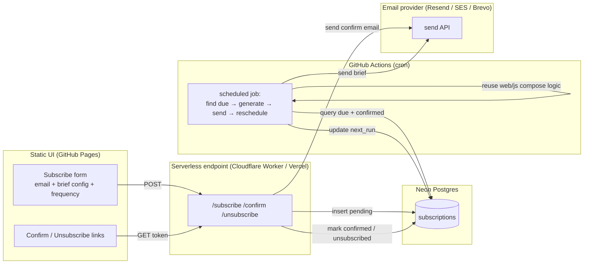

# Scheduled Email Delivery — Design & Implementation Plan

> **Status: PLANNED — not yet implemented.** This document is the build-ready
> design for letting a user subscribe an email address to a chosen brief and
> receive it on a schedule (daily / weekly / monthly). No code in this feature
> is wired up yet; the current app remains fully static and $0.

Roadmap item **R9**. Companion to the [main README](../README.md) and
[DATA-SOURCES.md](DATA-SOURCES.md).

---

## 1. User story

> As a strategy analyst, I want to pick a brief (city × demographic × product),
> enter my email, and choose a frequency, so that a freshly-generated brief is
> emailed to me automatically without my having to return to the site.

**UI additions** (to the existing generator): an *"Email this to me on a
schedule"* panel — email field, frequency select (Weekly / Monthly), and a
*Subscribe* button. On submit, the user gets a **confirmation email**; the
schedule only activates after they click confirm (double opt-in). Every delivered
brief carries an **unsubscribe** link.

---

## 2. Why this needs a backend (the static app can't do it alone)

Generation is client-side today. Scheduling email requires server-side secrets
(DB, email API key) and a timer, so three components are added:



**Reuse:** the cron job runs the **existing** brief logic. The composer,
catalog, and metrics in [`web/js/`](../web/js) are pure ES modules that already
run in Node (proven by `scripts/check.js`), so the job imports `compose.js` +
`sources.js` directly — no duplication.

---

## 3. Cost analysis (verified 2026)

**Bottom line: $0/month is achievable.** No mandatory cost. Optional ~$12/yr for
a custom domain (deliverability) — and a domain is already available for this
project, so the intended path is **$0**.

| Component | Choice | Free tier | Cost |
|---|---|---|---|
| Database | **Neon Postgres** | Free tier | **$0** |
| Subscription endpoint | **Cloudflare Workers** (or Vercel Hobby) | 100k req/day | **$0** |
| Scheduler | **GitHub Actions cron** | Unlimited on public repos | **$0** |
| Email send | **Resend** (primary, w/ domain) | 3,000/mo · 100/day | **$0** |
| Email send | **Brevo** (fallback, no domain) | 300/day forever | **$0** |

### Email provider comparison

| Provider | Free tier | Send to any recipient free? | After free |
|---|---|---|---|
| **Resend** | 3,000/mo (100/day) | Needs a **verified domain** (sandbox only emails your own address) | $20/mo → 50k |
| **Brevo** | **300/day** forever | Yes, after verifying a **single sender** (no domain needed) | $9/mo removes cap |
| **Amazon SES** | 3,000/mo for 12 mo | Needs domain verify + sandbox-exit approval | **$0.10 / 1,000** |
| **SendGrid** | — (free tier discontinued 2026) | — | paid only |

**Decision for this project:** **Resend + the available custom domain** — $0,
best deliverability via DKIM/SPF/DMARC. Brevo stays documented as the
zero-domain fallback.

Real cost only appears at scale (thousands of emails/day) or for a dedicated IP
($24.95/mo on SES) — neither applies to a portfolio project.

_Sources: [Resend pricing](https://resend.com/pricing) · [Resend resend.dev restriction](https://resend.com/docs/knowledge-base/403-error-resend-dev-domain) · [Brevo free plan](https://help.brevo.com/hc/en-us/articles/208580669) · [Amazon SES pricing](https://aws.amazon.com/ses/pricing/) · [GitHub Actions cron on public repos](https://cronbuilder.dev/blog/github-actions-cron-schedule.html)_

---

## 4. Data model (Neon)

```sql
-- sql/email_schema.sql (to be created at build time)
create table if not exists subscriptions (
  id             uuid primary key default gen_random_uuid(),
  email          text        not null,
  -- brief selection (mirrors web/js/catalog.js keys)
  cma_key        text        not null,
  bedroom        text        not null default 'Two bedroom',
  demographic    text        not null,
  product        text        not null,
  frequency      text        not null check (frequency in ('weekly','monthly')),
  -- lifecycle
  status         text        not null default 'pending'
                   check (status in ('pending','active','unsubscribed')),
  confirm_token  uuid        not null default gen_random_uuid(),
  unsub_token    uuid        not null default gen_random_uuid(),
  created_at     timestamptz not null default now(),
  confirmed_at   timestamptz,
  next_run       timestamptz,          -- set when confirmed
  last_sent_at   timestamptz,
  send_count     int         not null default 0
);

create index if not exists idx_sub_due
  on subscriptions (next_run) where status = 'active';
create unique index if not exists idx_sub_unique_active
  on subscriptions (email, cma_key, demographic, product, frequency)
  where status <> 'unsubscribed';   -- one active sub per (email, config)
```

**Rationale:** opaque `confirm_token`/`unsub_token` (never expose `id` in links);
partial index on `next_run` keeps the cron query cheap; partial unique index
prevents duplicate active subscriptions while allowing re-subscribe after unsub.

---

## 5. Endpoints (serverless — Cloudflare Worker)

All read the DB URL + email key from the Worker's **secret env**, never the client.

| Route | Method | Does |
|---|---|---|
| `/api/subscribe` | POST | Validate payload against `catalog.js` keys; rate-limit by IP; insert `status='pending'`; email a confirm link `…/api/confirm?t=<confirm_token>`. Returns 202. |
| `/api/confirm` | GET | Look up `confirm_token`; set `status='active'`, `confirmed_at=now()`, `next_run` = next slot; show a "you're subscribed" page. |
| `/api/unsubscribe` | GET | Look up `unsub_token`; set `status='unsubscribed'`. Show confirmation. One click, no login (CASL/CAN-SPAM). |

**Validation:** reject any `cma_key`/`demographic`/`product` not present in the
shared catalog; basic email-format check; per-IP + per-email rate limit to blunt
abuse. **Double opt-in is mandatory** — nothing sends recurring mail until
`/api/confirm` is hit.

---

## 6. Scheduler (GitHub Actions cron)

```yaml
# .github/workflows/deliver.yml (to be created at build time)
name: Deliver scheduled briefs
on:
  schedule:
    - cron: '0 12 * * *'      # daily 12:00 UTC; job filters which subs are due
  workflow_dispatch:
jobs:
  deliver:
    runs-on: ubuntu-latest
    steps:
      - uses: actions/checkout@v4
      - uses: actions/setup-node@v4
        with: { node-version: 20 }
      - run: npm ci
      - run: node scripts/deliver.js
        env:
          DATABASE_URL: ${{ secrets.DATABASE_URL }}
          RESEND_API_KEY: ${{ secrets.RESEND_API_KEY }}
          MAIL_FROM: briefs@your-domain.example
```

`scripts/deliver.js` (to be created): `SELECT … WHERE status='active' AND
next_run <= now()` → for each, import `web/js/sources.js` + `compose.js` to build
the brief → render to email-safe HTML → send via Resend with a `List-Unsubscribe`
header + visible unsubscribe link → set `last_sent_at`, bump `send_count`,
compute new `next_run` (+7d or +1 month).

**Cron caveats to design around:** min interval 5 min; runs can be delayed 5–30
min under load (fine for weekly/monthly); **scheduled workflows auto-disable after
60 days of repo inactivity** — a monthly no-op commit or the existing CI activity
keeps it alive.

---

## 7. Email provider setup (Resend + domain)

1. Add the domain in Resend → it issues DNS records. Add to the domain's DNS:
   - **SPF** (TXT): `v=spf1 include:amazonses.com ~all` *(Resend's exact value from dashboard)*
   - **DKIM** (CNAME × 3): `resend._domainkey…` records as provided
   - **DMARC** (TXT `_dmarc`): `v=DMARC1; p=none; rua=mailto:dmarc@your-domain`
2. Verify in Resend (usually minutes to a few hours for DNS).
3. Set `MAIL_FROM=briefs@your-domain`, `RESEND_API_KEY` as GitHub/Worker secrets.
4. **Fallback (no domain):** Brevo with a validated single sender; swap the send
   call — everything else is identical.

---

## 8. Compliance & anti-abuse (engineering best-practice, not legal advice)

- **Confirmed (double) opt-in** — recurring mail activates only after the user
  clicks confirm. Aligns with Canada's CASL and CAN-SPAM.
- **One-click unsubscribe** in every email (link + `List-Unsubscribe` header);
  honoured immediately.
- **Rate-limit** `/api/subscribe` per IP + per email to prevent using the form to
  spam third parties.
- **No PII beyond the email**; store only what's needed; unsubscribe = soft-delete
  (`status='unsubscribed'`), with a purge job optional.
- Keep the brief's existing guardrails (no rate forecasts, no regulatory advice).

---

## 9. Security

| Secret | Lives in | Never in |
|---|---|---|
| `DATABASE_URL` (Neon) | Worker secret env + GitHub Actions secret | client, repo |
| `RESEND_API_KEY` | Worker secret env + GitHub Actions secret | client, repo |

The repo being public is fine — no secret is committed; the browser only ever
calls `/api/*` (never the DB or the mail API directly).

---

## 10. Implementation checklist (when we build)

- [ ] `sql/email_schema.sql` + apply to Neon (`npm run migrate:email`)
- [ ] Cloudflare Worker: `/api/subscribe|confirm|unsubscribe` + validation + rate limit
- [ ] `web/`: subscribe panel (email, frequency), confirm/unsubscribe result pages
- [ ] `scripts/deliver.js` reusing `web/js/compose.js` + `sources.js`
- [ ] Email-safe HTML template (inline CSS) for the brief
- [ ] `.github/workflows/deliver.yml` cron + secrets
- [ ] Resend domain verification (DNS records)
- [ ] Tests: payload validation, token lifecycle, `next_run` math, email HTML render,
      unsubscribe idempotency → new `AC-E1…` acceptance criteria
- [ ] README: promote R9 from planned → shipped; add to Success criteria + How it works

## 11. Open decisions (for build time)

1. **Frequencies to offer** — Weekly + Monthly proposed (daily is noisy for a brief).
2. **Serverless host** — Cloudflare Workers (recommended) vs Vercel — either is $0.
3. **Send-time delivery** vs pre-generating — generate at send time (freshest data).
4. **Volume ceiling** — Resend free is 100/day; add a queue/throttle only if subs exceed it.
